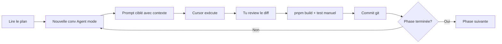

# Plan de refactoring CrossGuild — Architecture Senior

> **Référence architecture :** [OpenSource Together](https://github.com/opensource-together/opensource-together) — feature-based, pages thin, views par domaine.

---

## Référence : architecture OpenSource Together

OST est un monolithe Next.js 15 bien structuré. Voici ce qu'on reprend et ce qu'on adapte pour CrossGuild (e-commerce + Prisma + NextAuth).

### Ce qu'on reprend tel quel


| Pattern OST                 | Application CrossGuild                                                   |
| --------------------------- | ------------------------------------------------------------------------ |
| Dossier `src/` central      | Migrer `app/`, `components/`, `lib/` sous `src/`                         |
| `src/features/` par domaine | `auth`, `products`, `cart`, `orders`, `admin`, `reports`, `cms`...       |
| Structure feature constante | `components/`, `hooks/`, `services/`, `validations/`, `views/`, `types/` |
| `src/shared/`               | UI shadcn, lib utils, hooks globaux, types, validations communes         |
| Pages ultra-thin            | `page.tsx` = metadata + `<XxxView />` (~15 lignes max)                   |
| `src/app/providers.tsx`     | React Query centralisé via `shared/lib/query-client.ts`                  |
| `src/middleware.ts`         | Protection routes `/admin/*`, redirect login                             |
| `src/config/`               | Constantes app (`API_BASE_URL`, routes protégées)                        |
| Conventions de nommage      | `.view.tsx`, `.component.tsx`, `.service.ts`, `.hook.ts`, `.schema.ts`   |


### Ce qu'on adapte (CrossGuild = fullstack Prisma)

OST externalise son API (`API_BASE_URL`). CrossGuild a Prisma **dans** Next.js. On ajoute donc une couche server colocalisée par feature :

```
features/cart/
├── services/cart.service.ts       # Client → fetch /api/cart (pattern OST)
├── server/cart.server.ts          # Server → Prisma (utilisé par route handlers + actions)
├── validations/cart.schema.ts
├── hooks/use-cart.hook.ts
├── components/...
└── views/cart.view.tsx
```

Pas de dossier `server/` global — la logique Prisma vit **dans la feature** pour rester cohérent avec OST.

### Structure cible CrossGuild (alignée OST)

```
CrossGuild/
├── src/
│   ├── app/                          # Routes ONLY — thin pages
│   │   ├── layout.tsx
│   │   ├── providers.tsx             # QueryClient + Theme + Session
│   │   ├── page.tsx                  # → import HomepageView
│   │   ├── (shop)/                   # Route group: Navbar + Footer
│   │   │   ├── layout.tsx
│   │   │   ├── products/
│   │   │   ├── cart/
│   │   │   └── ...
│   │   ├── (auth)/                   # login, register, password-reset
│   │   ├── admin/                    # Admin layout + thin pages
│   │   └── api/                      # Thin route handlers → feature server/
│   │
│   ├── features/                     # Logique par domaine (cœur OST)
│   │   ├── auth/
│   │   │   ├── components/
│   │   │   ├── forms/
│   │   │   ├── hooks/
│   │   │   ├── services/             # Client API calls
│   │   │   ├── server/               # Prisma logic (CrossGuild-specific)
│   │   │   ├── validations/
│   │   │   ├── types/
│   │   │   └── views/                # login.view.tsx, register.view.tsx
│   │   ├── products/
│   │   ├── cart/
│   │   ├── orders/
│   │   ├── wishlist/
│   │   ├── reviews/
│   │   ├── admin/
│   │   ├── reports/
│   │   └── cms/
│   │
│   ├── shared/                       # Code transversal (OST pattern)
│   │   ├── components/
│   │   │   ├── ui/                   # shadcn (~40 composants)
│   │   │   └── layout/               # navbar, footer, admin-sidebar
│   │   ├── hooks/
│   │   ├── lib/
│   │   │   ├── utils.ts              # cn()
│   │   │   ├── prisma.ts
│   │   │   ├── auth.ts
│   │   │   ├── query-client.ts
│   │   │   └── api-response.ts       # apiSuccess, handleApiError
│   │   ├── services/                 # Services partagés (upload, email)
│   │   ├── types/
│   │   └── validations/              # Schémas Zod communs (pagination, etc.)
│   │
│   ├── config/
│   │   └── config.ts                 # API_BASE_URL, protected routes
│   │
│   └── middleware.ts
│
├── prisma/
├── public/
└── docs/
    └── ARCHITECTURE.md
```

### Pattern page OST → CrossGuild

```tsx
// src/app/cart/page.tsx  (~15 lignes)
import type { Metadata } from "next";
import CartView from "@/features/cart/views/cart.view";

export const metadata: Metadata = { title: "Panier" };

export default function CartPage() {
  return <CartView />;
}
```

```tsx
// src/features/cart/views/cart.view.tsx
"use client";
import { CartItemsList } from "../components/cart-items-list.component";
import { CartSummary } from "../components/cart-summary.component";
import { useCart } from "../hooks/use-cart.hook";

export default function CartView() {
  const { items, isLoading } = useCart();
  // orchestration UI
}
```

```typescript
// src/features/cart/services/cart.service.ts  (client, pattern OST)
export const getCart = async () => {
  const res = await fetch("/api/cart", { credentials: "include" });
  if (!res.ok) throw new Error("Failed to fetch cart");
  return res.json();
};
```

```typescript
// src/features/cart/server/cart.server.ts  (server, CrossGuild-specific)
import { prisma } from "@/shared/lib/prisma";

export async function addToCart(userId: string, itemId: string, qty: number) {
  // logique Prisma unifiée — utilisée par route.ts ET server actions
}
```

### Conventions de nommage (OST)


| Type           | Suffixe          | Exemple                         |
| -------------- | ---------------- | ------------------------------- |
| Page view      | `.view.tsx`      | `cart.view.tsx`                 |
| Composant UI   | `.component.tsx` | `product-card.component.tsx`    |
| Hook           | `.hook.ts`       | `use-cart.hook.ts`              |
| Service client | `.service.ts`    | `cart.service.ts`               |
| Server logic   | `.server.ts`     | `cart.server.ts`                |
| Validation Zod | `.schema.ts`     | `cart.schema.ts`                |
| Type TS        | `.type.ts`       | `cart.type.ts`                  |
| Store Zustand  | `.store.ts`      | `checkout.store.ts` (si besoin) |


---

## Diagnostic actuel (inchangé)

CrossGuild : ~60 routes API, ~76 composants, logique métier dans les handlers, composants 600-1300 lignes, failles auth critiques, pas de middleware.

Problèmes critiques : routes admin sans auth, upload/CMS ouverts, double implémentation panier, 3 systèmes reports dupliqués, React Query installé mais mort.

---

## Phase 0 — Fondations et migration `src/` (1-2 jours)

### 0.1 Standardiser l'outillage

- pnpm unique → supprimer `package-lock.json`
- Supprimer `tailwind.config.js` (garder `.ts`)
- Nettoyer deps : `bcrypt`/`bcryptjs`, `react-toastify`, `nodemailer`
- Toast unique : Sonner

### 0.2 Migration vers `src/` (première étape structurelle)

- Déplacer `app/` → `src/app/`
- Déplacer `components/ui/` → `src/shared/components/ui/`
- Déplacer `lib/` → `src/shared/lib/`
- Déplacer `hooks/` → `src/shared/hooks/`
- Déplacer `types/` → `src/shared/types/`
- Mettre à jour `tsconfig.json` : `"@/*": ["./src/*"]`
- Mettre à jour `components.json` (shadcn paths)

### 0.3 Supprimer le code mort

- `ProductReview.tsx`, `ProductReview222.tsx`, `CategoryPageClient.tsx`
- `components/sections/`, `pages/api/categoriees.ts`
- `app/api/reports/page.tsx` (UI dans /api/)
- Endpoints dev : test-email, test-cloudinary, dev/password-reset-tokens

### 0.4 Conventions et documentation

- Créer `docs/ARCHITECTURE.md` (structure, naming, patterns OST)
- Créer `.cursor/rules/architecture.mdc` (rule Cursor permanente)

---

## Phase 1 — Sécurité (2-3 jours)

### 1.1 `src/middleware.ts` (pattern OST)

```typescript
const protectedRoutes = ["/admin", "/profile", "/cart/checkout"];
const adminRoutes = ["/admin"];
const authRoutes = ["/login", "/auth/register"];
// Redirect si non auth, redirect si déjà auth sur login
```

### 1.2 Helpers API dans `src/shared/lib/`

- `with-auth.ts`, `with-admin.ts`, `with-validation.ts`
- `api-response.ts` — format `{ success, data?, error? }`
- `handle-api-error.ts` — mappe Prisma P2002, P2025

### 1.3 Fix Prisma

- Singleton unique, supprimer `new PrismaClient()` × 7
- Supprimer `$disconnect()` dans route handlers

---

## Phase 2 — Backend par feature (4-5 jours)

### 2.1 Server logic colocalisée

Pour chaque domaine, créer `features/X/server/X.server.ts` :

- `cart.server.ts` — unifie cart-actions + api/cart (fix clonage items)
- `order.server.ts` — createOrder avec `$transaction`
- `product.server.ts`, `auth.server.ts`, `report.server.ts`, etc.

### 2.2 Validations Zod dans `features/X/validations/`

Schémas réutilisés front (react-hook-form) + back (withValidation).

### 2.3 Thin route handlers (~20-40 lignes)

```typescript
// src/app/api/cart/route.ts
import { addToCart } from "@/features/cart/server/cart.server";
import { withAuth } from "@/shared/lib/with-auth";

export const POST = withAuth(async (req, session) => {
  const data = await req.json();
  const cart = await addToCart(session.user.id, data);
  return apiSuccess(cart);
});
```

### 2.4 Consolider reports

- Supprimer `/api/reports/*` → tout sous `/api/admin/reports/*`
- Un seul `features/reports/server/report.server.ts`

Ordre migration : **auth → cart → orders → products → admin → reports → cms**

---

## Phase 3 — Frontend OST (5-7 jours)

### 3.1 Route groups

- `src/app/(shop)/layout.tsx` — Navbar + Footer (supprime duplication 12+ pages)
- `src/app/(auth)/layout.tsx` — layout centré
- Consolider auth : `/login` unique, supprimer `/auth/signin`

### 3.2 Providers (pattern OST)

`src/app/providers.tsx` :

```tsx
<ThemeProvider>
  <SessionProvider>
    <QueryClientProvider client={getQueryClient()}>
      {children}
    </QueryClientProvider>
  </SessionProvider>
</ThemeProvider>
```

### 3.3 Services + hooks par feature (pattern OST)

- `features/cart/services/cart.service.ts` + `hooks/use-cart.hook.ts`
- Remplacer fetch/axios dispersés
- Supprimer axios si plus utilisé

### 3.4 Migration features (ordre)

1. `features/auth/` — views + forms + services
2. `features/products/` — ProductFilters unifié, ProductDetails
3. `features/cart/` — CartView + composants
4. `features/wishlist/`, `features/reviews/`
5. `features/admin/`, `features/reports/`, `features/cms/`

Chaque migration = convertir `page.tsx` en thin page + `views/xxx.view.tsx`

---

## Phase 4 — Décomposition monolithiques (4-5 jours)

Objectif : pages < 20 lignes, views < 150 lignes, composants < 100 lignes.


| Fichier actuel                             | Découpage cible                                     |
| ------------------------------------------ | --------------------------------------------------- |
| `admin/reports/page.tsx` (1311L)           | `features/reports/views/` + tabs components         |
| `admin/reviews/page.tsx` (1052L)           | `features/admin/reviews/`                           |
| `admin/content-management/page.tsx` (960L) | `features/cms/`                                     |
| `profile/page.tsx` (920L)                  | `features/auth/views/profile.view.tsx` + composants |
| `cart-new.tsx` (641L)                      | `features/cart/components/`                         |
| `ProductDetails.tsx` (656L)                | `features/products/components/`                     |
| `login/page.tsx` (492L)                    | `features/auth/views/login.view.tsx` + forms        |


Unifier doublons : CategoryFilters × 3 → `product-filters.component.tsx`

---

## Phase 5 — Prisma (2 jours, en parallèle Phase 1-2)

- Enums `OrderStatus`, `ReviewStatus`
- RBAC : Option A (garder `isAdmin`, supprimer `Role`) recommandé
- Index : `Item.slug`, `Order.userId`, `Order.status`, etc.

---

## Phase 6 — Tests + CI (2-3 jours)

- Vitest : `*.server.ts`, `*.schema.ts`
- Playwright : auth, cart/checkout, admin access
- GitHub Actions : lint + typecheck + test + build

---

## Phase 7 — Optimisation code (ultérieure)

Performance React/Next, ESLint strict, bundle analysis, naming cleanup — **après phases 0-6**.

---

## Comment travailler avec Cursor — Workflow recommandé

### Règle d'or : 1 conversation = 1 sous-tâche ciblée

**Ne donne PAS le plan entier à Cursor en mode Agent.** Cursor performe mieux avec des tâches précises et limitées. Le plan complet sert de **feuille de route pour toi**, pas de prompt unique.

### Cette conversation vs nouvelles conversations


| Usage                                    | Quand                                                    |
| ---------------------------------------- | -------------------------------------------------------- |
| **Cette conversation**                   | Plan maître, questions architecture, ajustements du plan |
| **Nouvelle conversation par sous-tâche** | Exécution concrète (Phase 0, migration auth, etc.)       |


Pourquoi des nouvelles conversations :

- Contexte frais = moins d'erreurs sur de gros refactors
- Évite la limite de tokens sur 60+ fichiers
- Chaque session = reviewable indépendamment

### Workflow étape par étape




### Template de prompt pour chaque sous-tâche

Copie-colle et adapte pour chaque session Agent :

```
Contexte : Refactoring CrossGuild vers architecture feature-based inspirée de OpenSource Together.
Plan complet : [lien ou @plan file]
Phase en cours : Phase X — [nom]

Tâche précise :
- [liste de 3-5 actions concrètes max]

Conventions à respecter :
- Structure src/features/ avec views, components, services, server, validations
- Naming : .view.tsx, .component.tsx, .service.ts, .hook.ts, .schema.ts
- Pages thin (~15 lignes) qui importent une View
- @/ path alias vers src/

Contraintes :
- Ne pas toucher aux features pas encore migrées
- Garder l'app fonctionnelle (pnpm build doit passer)
- Pas de commit sauf si je le demande
```

### Découpage recommandé des prompts (pas 1 prompt = 1 phase entière)

**Phase 0** — 3 sessions séparées :

1. "Nettoie deps, lockfiles, code mort"
2. "Migre vers src/ et mets à jour tsconfig + shadcn paths"
3. "Crée docs/ARCHITECTURE.md et .cursor/rules/architecture.mdc"

**Phase 1** — 2 sessions :

1. "Crée src/middleware.ts + src/shared/lib/api-response.ts + with-auth/with-admin"
2. "Applique withAdmin à toutes les routes /api/admin/* et fix Prisma singleton"

**Phase 2** — 1 session par domaine :

1. "Migre cart : cart.server.ts, cart.service.ts, cart.schema.ts, thin route handlers"
2. "Migre orders avec $transaction"
3. "Migre auth..."
4. etc.

**Phase 3** — 1 session par feature frontend :

1. "Migre features/auth : views, forms, services, thin pages"
2. "Migre features/products : ProductFilters unifié, ProductDetails"
3. etc.

### Mode Cursor à utiliser


| Mode                        | Usage                                      |
| --------------------------- | ------------------------------------------ |
| **Plan** (comme maintenant) | Conception, questions, ajustements du plan |
| **Agent**                   | Exécution des sous-tâches                  |
| **Ask**                     | Comprendre un fichier avant de migrer      |


### Avant chaque session Agent

1. `git checkout -b refactor/phase-X-nom`
2. `pnpm dev` tourne ? App fonctionne ?
3. Donne le prompt ciblé
4. Laisse Cursor travailler

### Après chaque session Agent

1. Review le diff (onglet Source Control)
2. `pnpm build` — doit passer
3. Test manuel de la feature touchée
4. `git commit -m "refactor(cart): migrate to feature-based architecture"`
5. Si OK → session suivante

### Créer une Cursor Rule (important)

En Phase 0, demande à Cursor de créer `.cursor/rules/architecture.mdc` avec :

- Structure des dossiers OST
- Conventions de nommage
- "Pages must be thin, import from features/X/views/"
- "Never put Prisma queries directly in route.ts"

Cette rule s'appliquera **automatiquement** à toutes les futures conversations.

### Ce que Cursor ne fera PAS bien seul

- Refactorer les 60 routes API en une seule session → trop gros
- Décider seul des trade-offs métier (RBAC, routes auth)
- Garantir zéro régression sans que tu testes

**Tu restes le chef d'orchestre** : Cursor est l'exécutant, tu valides chaque étape.

---

## Premier sprint concret (semaine 1)


| Jour | Session Cursor | Prompt                                            |
| ---- | -------------- | ------------------------------------------------- |
| J1   | Session 1      | Phase 0.1 — nettoyage deps + code mort            |
| J1   | Session 2      | Phase 0.2 — migration src/ + tsconfig             |
| J2   | Session 3      | Phase 0.4 — ARCHITECTURE.md + cursor rule         |
| J2   | Session 4      | Phase 1.1 — middleware.ts                         |
| J3   | Session 5      | Phase 1.2 — withAuth/withAdmin + fix routes admin |
| J4-5 | Session 6      | Phase 2 — cart.server.ts + order.server.ts        |


Estimation totale : **4-5 semaines** (architecture + tests), puis ~1 semaine optimisation.

---

## Principes directeurs

1. **Inspiré OST, adapté Prisma** — services client + server colocalisé par feature
2. **Migration incrémentale** — 1 domaine à la fois, build OK à chaque commit
3. **Pages thin, views épaisses** — pattern OST strict
4. **1 session Cursor = 1 sous-tâche** — jamais le plan entier d'un coup
5. **Commit après chaque sous-tâche** — rollback facile

